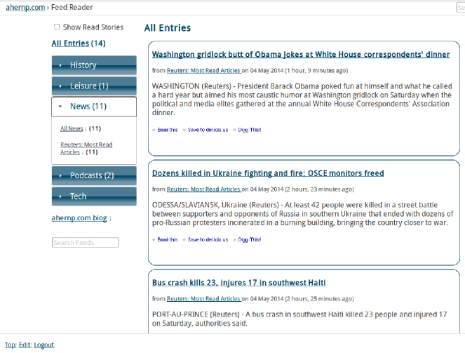
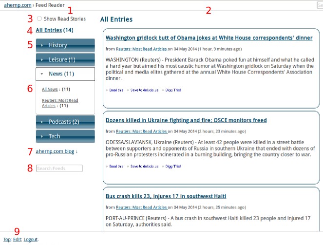
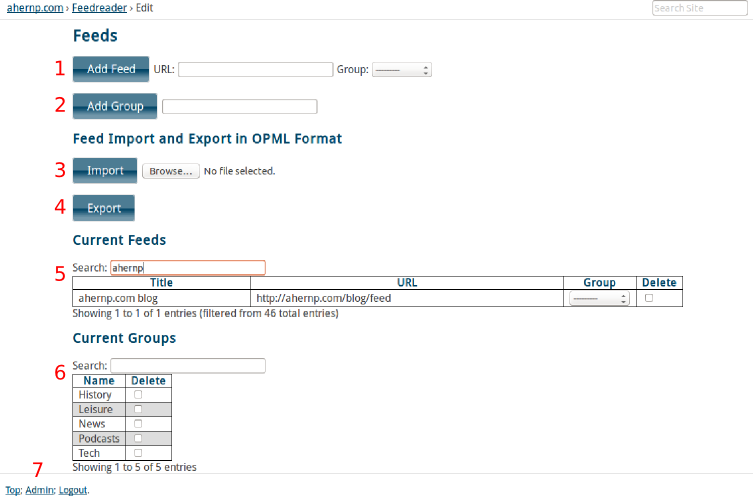

.. _overview:

Overview
========

Django Feedreader is a web application built using the
`Django <http://www.djangoproject.com/>`_ framework.
It enables users to aggregate the contents of RSS feeds.

The link, title and descriptions of each feed and recent feed entries
are saved in the database.

A ``poll_fields``
Django command is included which can be run on a regular basis using
``cron`` or some other scheduling mechanism to keep the local database
of recent entries up to date.

.. index:: Sample Feedreader Output

Sample Output
-------------

.. _image-sample-output:

.. index:: Usage

Usage
-----

Feed List
~~~~~~~~~

.. _image-annotated-output:

In the image above:

1. Menu controlling what output is displayed.

2. Most recent entries.

3. Toggle between showing all entries or only those which are unread.

4. Show entries from all feeds.
   In brackets is number of unread entries.
   Clicking on this number marks them all as read.

5. Feed groups.
   As well as the group name, each entry shows the number of unread
   entries.
   The down-arrows can be clicked to poll all the feeds in the group.

6. Feed group. Shows the feed names.
   These can be individually selected.
   The down-arrows can be clicked to poll an individual feed.

7. Feeds not in any group.

8. String search feed and entry text.

9. Link to Edit Feeds page.

In addition to explicitly marking sets of entries as read,
scrolling to the end of the page causes all of the unread entries
displayed to that point to be marked as read.
Additional entries, if any exist, are added to list displayed.

The numbers of entries initially displayed, how many entries are saved
in the local database and how many additionally entries are displayed
on scrolling to the bottom of the page are set in the
``Options`` model.

Edit Feeds
~~~~~~~~~~

.. _image-annotated-output2:

In the image above:

1. Add feed. Optionally assign new feed to an existing group.

2. Add group.

3. Import feeds in OPML format.

4. Export all current feeds in OPML format.

5. Options controlling how man entries are displayed and stored
   in the database.
   
6. Current feeds. Filter table using Search field. 
   Can only delete or change group assignment of feeds.

7. Existing groups. Can delete groups.

Adding a new feed causes it to be polled immediately. 
All edits are applied immediately.
